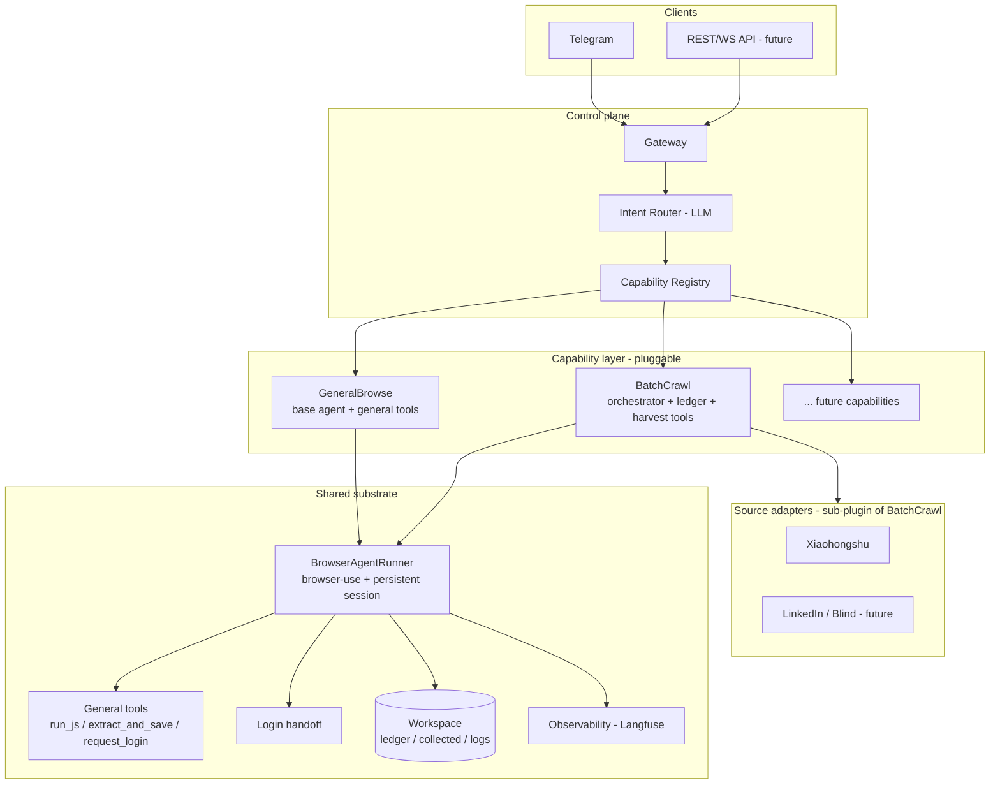
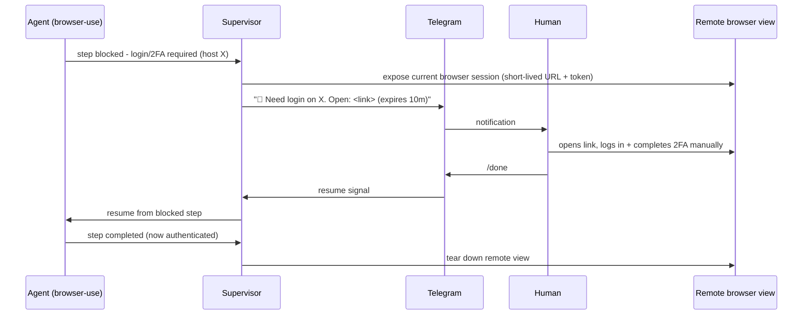

# Design: Supervised Browser-Agent Platform ("on-call agent")

> Draft v0.2 · 2026-07-17 · status: reflects built system + extensibility redesign
> A 24/7-available agent you talk to over Telegram that runs browser + API tasks
> on demand and on schedule, and hands off login to you (the human) when needed.
>
> **v0.2 note:** the built system now has the Telegram gateway, browser-use runtime,
> human login handoff, observability (Langfuse), and ONE specialized capability — the
> **rednote batch-crawl** (efficient long-horizon post collection). §4–§4.5 are rewritten
> to make adding *new* capabilities a plug-in, not a refactor — and to resolve the
> "rigid pipeline vs. hallucination-prone skill" tension.

---

## 1. One-paragraph vision

An agent process that **lives 24/7 in a sandbox** and is **reachable on demand** through
a chat channel (Telegram). When you message it ("find new SWE new-grad postings
today", "consolidate this interview post"), it plans and executes the task using
**APIs where they exist and a real browser where they don't**. When a task hits a
**login / 2FA wall**, it does **not** try to defeat it — it **pauses and hands the
browser to you** via a live remote-browser link, waits for you to authenticate, then
resumes. It can also run **scheduled jobs** (e.g., a morning job-opening sweep).

This is "open-claude-style always-on agent", **specialized for supervised browser
work**, with **human-in-the-loop authentication as a first-class feature** rather than
an afterthought.

---

## 0. Guiding principle — Occam's razor (never over-engineer)

> **Build the simplest thing that solves the actual problem. Add complexity only when a
> real, observed need forces it — never speculatively.**

- Prefer the **smallest viable component** over a framework. A cron + a script beats a
  distributed scheduler until proven otherwise.
- **Choose the simplest *reliable* path for each case, not by dogma.** Often that's an
  API; but a browser can be the simpler choice when there is no clean API, when the
  API needs heavy OAuth, or when it's undocumented/brittle. Pick per-case, not by rule.
- **No speculative generality**: no plugin systems, queues, microservices, or config
  knobs for use cases that don't exist yet.
- **Delete before you add**: if a feature isn't earning its keep, remove it (cf. the
  PKB lesson — unused features are cost, not value).
- Every added layer must justify itself against a concrete failure it prevents.
  If you can't name that failure, don't build the layer.

This principle overrides the rest of this doc: where any section below suggests more
machinery than the current milestone needs, **do the simpler thing**.

---

## 2. Goals / non-goals

### Goals
- **Always available**: a long-lived process; responds whenever the user pings it.
- **On-demand + scheduled**: ad-hoc chat tasks *and* cron-like daily jobs.
- **Human-in-the-loop auth**: clean login handoff via a live remote browser view.
- **API-first, browser-second**: prefer official/structured sources; use browser-use
  only for sites with no API.
- **Reliability surface**: every run is logged, evaluated, and replayable
  (this is the part that makes it résumé-grade, not a script).

### Non-goals (explicit guardrails)
- ❌ **No 24/7 automated social-media crawling.** The agent is always *available*; it
  does not continuously scrape any platform.
- ❌ **No anti-bot / CAPTCHA evasion.** No stealth fingerprints, proxy rotation, or
  captcha-solving services. If a site blocks automation, that's a stop signal.
- ❌ **No ToS circumvention.** Login is performed *by the human*, in the human's
  session. The agent never bypasses MFA or risk-control.

---

## 3. Core concepts

| Concept | Meaning |
|---|---|
| **Always-on host** | A small VPS/container where the agent process + browser live. |
| **Control channel** | Telegram bot: receives commands, sends notifications, asks for approval, delivers login-handoff links. |
| **Task** | A unit of work (ad-hoc or scheduled) with a plan, steps, status, and artifacts. |
| **Source adapter** | A pluggable fetcher: `api` (Greenhouse/Lever/Ashby/RSS) or `browser` (browser-use). |
| **Login handoff** | When a `browser` step needs auth, the agent exposes a live remote browser and pings the human to log in. |
| **Workspace** | Persistent store for task state, artifacts, sessions/cookies, logs, memory. |
| **Scheduler** | Triggers recurring tasks (daily sweep) and re-tries. |
| **Capability** | A registered, self-describing unit of specialized behavior the router can dispatch to (e.g. `BatchCrawl`). Owns its orchestration + tools. **Code-backed → reliable + efficient.** |
| **Tool** | A single deterministic action the agent may call (`run_js`, `extract_and_save`, `open_search`, `open_next_post`, `request_login`). Constrains *what the LLM can do*. |
| **Skill** | A prompt recipe (Markdown) that *steers* the general agent. Flexible + user-authorable, but hallucination-prone → for low-risk one-shots only. |
| **Source adapter** | Site-specific glue *inside* a capability (search URL, discover/extract JS, id parsing). Swapping it ports `BatchCrawl` to a new site without touching the engine. |

---

## 4. Architecture (v0.2 — capability-layered)

The system is three layers: a **control plane** (route intent), a **capability layer**
(pluggable specialized behaviors), and a **shared substrate** (the browser runtime,
tools, handoff, persistence, observability). Clients are just one more edge.



### Layer responsibilities
- **Gateway** — the inbound surface (Telegram now; a REST/WS API later so the same
  core serves a web app / CLI). Streams progress, delivers login-handoff links.
- **Intent Router (LLM)** — reads the raw request and picks a capability + extracts its
  parameters (site, target, scope). This is where *flexibility* lives; it is an LLM
  call, not keyword matching. Falls back to `GeneralBrowse`.
- **Capability Registry** — capabilities self-register with a `key` + `description`.
  The router's menu is *built from the registry*, so adding a capability needs **no**
  router edit.
- **Capability layer** — each capability owns its orchestration and tools:
  - `GeneralBrowse`: the base browser-use agent + general tools, for one-off tasks.
  - `BatchCrawl`: the long-horizon harvester — chunked fresh-agent loop over a shared
    session, a durable ledger (dedup + queue), and harvest tools (`open_search`,
    `discover_candidates`, `open_next_post`, `extract_and_save`), plus a **source
    adapter** for site specifics. This is the efficient path the base agent can't do.
- **Shared substrate** — `BrowserAgentRunner` (browser-use + persistent profile),
  login handoff, the general tool registry, the workspace/ledger, and observability.
  Every capability composes these; none re-implements them.
- **Source adapters** — site-specific glue *within* `BatchCrawl` (search URL, discover
  /extract JS, note-id parsing). Adding a site = a new adapter, not a new pipeline.

---

## 4.5 Capability architecture — extensible without refactor, reliable without hallucination

**The problem (observed).** Today there is one hardcoded capability (rednote crawl).
There are three ways to add behavior, each with a flaw:

| Approach | Extensible? | Reliable / efficient? | Flaw |
|---|---|---|---|
| **Hardcoded pipeline** (current crawler) | ❌ new task = refactor | ✅ | rigid; doesn't scale to many task types |
| **Prompt skill** (Markdown recipe) | ✅ drop-in | ❌ | LLM hallucinates the steps; no guarantees for long/stateful work |
| **Pure general agent** | ✅ | ❌ for long tasks | inefficient/unreliable — the reason `BatchCrawl` exists |

**The resolution: split responsibility — the LLM owns *judgment*, code owns *guarantees*.**

> Skills tell the LLM **what to do** (fragile). Capabilities give the LLM **tools that
> do it right** (robust). The fix is to move must-be-correct logic out of the *prompt*
> and into *code/tools* — the agent can only do what its tools allow, so hallucination
> cannot corrupt the reliable core.

**A Capability is a registered, self-describing plug-in:**

```python
class Capability(Protocol):
    key: str                 # "batch_crawl"
    description: str         # fed to the router LLM so it knows WHEN to pick this
    async def run(self, request: str, params: dict, ctx: RunContext) -> Result
```

- Capabilities **self-register** into the registry; the **router menu is generated**
  from their descriptions. **Adding a capability = new module + register(). No core edit.**
- The router (LLM) decides *which* capability + fills typed params — flexible intent,
  structured hand-off.

**Two capability shapes (choose per need):**
1. **Orchestrated capability** (e.g. `BatchCrawl`) — code-driven loop with state
   (chunking, ledger, deterministic navigation/search, tools, adapter). Use for
   long-horizon / stateful / reliability-critical work.
2. **Skill** (prompt recipe) — lightweight steering of `GeneralBrowse`. Keep for the
   **long tail** and user-authored one-shots where a wrong step is cheap.

**Anti-hallucination levers (why capabilities are safe where skills aren't):**
- **Constrain by tools, not prose** — the reliable actions (search URL, queue, dedup,
  navigation, login handoff) are *tools/orchestration*, not instructions the model can
  drift from.
- **Deterministic core, fuzzy edges** — code owns the must-be-right parts; the LLM is
  left only the genuinely judgmental parts (relevance, query phrasing, when to stop).
- **Structured I/O at boundaries** — typed router output, typed records; validate at
  the seam so bad data can't flow downstream.

**Promotion path (gives flexibility *and* reliability):** a behavior starts as a
**skill** (fast to author, no code). When it proves *repeated*, *long-horizon*, or
*reliability-critical*, **promote it to an orchestrated capability** — lift the fragile
prompt steps into tools + a small orchestrator. You pay engineering cost only where it
earns its keep (per §0, Occam). The rednote crawler is exactly this: a search-and-
collect *skill* that graduated into the `BatchCrawl` capability once it needed dedup,
resume, and hundreds-of-posts scale.

**How the current pieces map:**

| Concern | Where it lives | Owner |
|---|---|---|
| "Is this a crawl or a one-off?" | Intent Router | LLM |
| "Which company/site/scope?" | Router → typed params | LLM |
| Search that actually works | `open_search` tool (direct results URL) | code |
| No duplicate / resume | ledger + `open_next_post` | code |
| Is *this post* relevant? | agent judgment at save time | LLM |
| Login wall | heuristic + `request_login` tool | code + LLM |
| Site specifics (JS, id, URL) | Source adapter | code |

Net: **adding a new capability (e.g. "monitor a page", "fill a form", "apply to a job")
is a new registered module reusing the substrate — no refactor of the core, and the
reliability-critical parts are code, not hopeful prompting.**

---

## 5. Login handoff (Option 1 — remote browser view)

The chosen approach. Flow:



Design notes:
- The human authenticates **in the agent's actual browser session**, so the resulting
  cookies persist in the **persistent profile** → future tasks on that site reuse the
  session (no repeated logins until it expires).
- Remote view URL is **short-lived, single-use, token-gated**; torn down immediately
  after handoff.
- 2FA never touches the agent — the human does it.
- **Fallback (Option 2, cookie-sync)** kept as a simpler path for MVP testing: human
  logs in locally, exports storage state, agent imports it.
### Transport decision: CDP screencast (not noVNC)

The live view is served as a **CDP screencast page** over a short-lived tunnel, **not** a
full noVNC desktop. Reasons:
- **Smaller surface**: streams a single tab, not the whole sandbox display → smaller
  blast radius for a security-sensitive login screen.
- **Reuse**: browser-use already drives the page over CDP, so we reuse that connection
  instead of standing up a separate VNC server.
- **Mobile-friendly**: renders cleanly in Telegram's in-app browser on a phone; lighter
  payload → lower latency than full-desktop VNC.
- **No domain required for MVP**: served behind a free Cloudflare Tunnel (`*.trycloudflare.com`)
  with a token-gated URL; buy a stable domain only later for a branded link.
---

## 6. Data-source strategy (API-first)

Reserve browser-use for sites that genuinely require it.

| Need | Preferred (API/structured) | Browser-use fallback |
|---|---|---|
| Job postings | Greenhouse, Lever, Ashby, Workday public JSON; company RSS | Simplify/board pages with no API |
| Aggregators | Official API / export if available | rendered listing pages (login handoff) |
| Interview posts | manual paste-in (separate module) | — (no social crawling) |

**Default heuristic (not absolute):** when a clean, stable structured source exists,
the `api` adapter is usually the simpler, more robust choice. But if the only API is
undocumented, heavily auth-gated, or more fragile than just driving the page, the
`browser` adapter can legitimately be simpler — decide per source, per Occam's razor.

---

## 7. Application scenarios

### 7.1 Flagship — Daily job-opening monitor
- **Trigger:** scheduled each morning + on-demand ("any new openings?").
- **Flow:** poll ATS APIs + a few board pages → normalize to a job schema
  (company, role, location, posted_at, url, source) → **dedup** against seen set →
  push *new* matches to Telegram with apply links → optionally draft a tracker row.
- **Why it's good:** genuinely useful (automates the tedious daily hunt), defensible
  (mostly APIs), measurable (new-detection precision, dedup correctness).

### 7.2 Secondary — Interview-experience consolidation (manual ingest)
- **Separate module, no crawling.** You paste/forward an interview post to the bot →
  LLM extraction into a structured record (company, role, round, questions, topic,
  difficulty, date) → dedup + classify → stored + queryable.
- Anchored by a small **hand-labeled gold set** for extraction-accuracy eval
  (avoids the LLM-as-judge circularity discussed earlier).

---

## 8. Telegram interaction protocol (sketch)

- `\new <task description>` — start an ad-hoc task.
- `\jobs` — run the job sweep now.
- `\status` — current/last task status.
- `\done` — signal that a login handoff is complete.
- `\approve <id>` / `\deny <id>` — respond to an approval gate.
- `\ingest` (+ pasted text) — interview-experience ingest.
- Bot → user: progress updates, `🔐 login needed` + link, `⚠️ approval needed`,
  result summaries, daily digest.

---

## 9. Reliability + eval layer (the résumé differentiator)

Without this it's a script; with it, it's an AI-engineering project.

- **Run records**: every task → status, steps, latency, cost, artifacts (replayable).
- **Traces**: per-step timeline (plan → fetch → parse → notify).
- **Metrics**:
  - job monitor: new-detection **precision/recall**, **dedup** correctness,
    daily run success rate.
  - ingest: extraction **field accuracy** vs. gold set, dedup precision.
- **Guardrails/evals run on a schedule**; regressions alert via Telegram.
- **Failure handling**: typed errors, bounded retries with backoff, no silent
  fallback (explicit-over-implicit).

---

## 10. Security & safety

- **Prompt-injection awareness**: pages/posts are untrusted input; the agent treats
  fetched content as data, not instructions; sensitive actions are gated.
- **Approval gates**: any write/irreversible action (e.g., submitting an application)
  requires explicit Telegram approval.
- **Secret hygiene**: no passwords in the agent/LLM context; auth is human-performed
  in the remote view; the persistent profile holds only resulting session cookies.
- **Least privilege**: per-task allowed-tools + allowed-hosts whitelist.
- **No evasion**: blocked-by-anti-bot ⇒ stop + notify, never circumvent.

---

## 11. Tech stack (proposed)

- **Language**: Python (reuse existing `agent/` infra: `bot.py`, `scheduler.py`,
  `server.py`, `session.py`).
- **Browser**: browser-use (open-source) + persistent Chrome profile.
- **Remote view**: **CDP screencast page** (single-tab live view), served over a
  Cloudflare Tunnel; noVNC rejected (full-desktop, larger surface).
- **Chat**: Telegram Bot API (long-poll or webhook).
- **Scheduler**: existing scheduler / APScheduler / cron.
- **Store**: SQLite/JSON workspace for MVP; Postgres later if needed.
- **Host**: a small always-on VPS or container; browser headful behind the remote view.
- **Deployment**: **Docker** — the agent + headful browser + remote-view server packaged
  in one image (compose for store/tunnel), so the 24/7 host is reproducible and portable.
- **Observability**: structured logging + metrics (run status, latency, cost, dedup/
  extraction accuracy), traces per step, and Telegram alerts on regressions.

---

## 12. Build sequence (milestones)

1. **M1 — Always-on bot skeleton**: Telegram bot on a host; `\new`/`\status`;
   echo + task record in workspace.
2. **M2 — API job source**: one ATS adapter (Greenhouse or Lever) → normalized
   schema → dedup → daily digest to Telegram. *(No browser yet.)*
3. **M3 — Scheduler**: morning sweep + retry/backoff + "new since last run".
4. **M4 — browser-use + login handoff (Option 1)**: remote browser view, handoff
   flow, persistent profile, one site that needs login.
5. **M5 — Reliability/eval layer**: run records, metrics, scheduled eval + alerts.
6. **M6 — Interview-ingest module**: paste-in extraction + gold-set eval.

MVP = M1–M3 (useful + demoable without any browser risk). M4 adds the headline
human-in-the-loop feature.

---

## 12.5 Future features (post-MVP)

Deferred until the M1–M5 core is proven; listed so the architecture leaves room.

- **Agent memory**: durable, queryable memory so the bot recalls prior tasks, preferences,
  and per-site state (e.g., known logins, dedup history, what "good" looks like) across
  sessions — beyond the per-task workspace record. Likely a small store + retrieval seam
  on the Supervisor; reuse browser-use filesystem/memory rather than build new.
- **UX / latency optimization**: tighten end-to-end responsiveness — streaming progress,
  faster login-handoff link delivery, prefetch/cache for common sources, and snappier
  remote-view startup, so it feels instant on the phone.
- **Docker deployment**: ship the whole agent (process + headful browser + remote-view
  server) as one Docker image, with compose for store/tunnel, so the 24/7 host is
  reproducible, portable, and one-command redeployable.
- **Observability**: structured logs + metrics + per-step traces (run status, latency,
  cost, dedup/extraction accuracy) with Telegram alerts on regressions — turns the
  reliability layer (§9) into a queryable dashboard.

## 13. Open questions / risks

- **Host choice**: **decided → AWS, persistent always-on VPS** (Lightsail/EC2), for a
  warm browser + low-latency, fluent bot interaction. China-side mirror (Alibaba HK) and
  on-demand lightweight variant deferred; see `host-deployment-comparison.html`.
- **Remote-view security**: hardening the short-lived token-gated CDP screencast URL.
- **Session longevity**: how often logins expire per target site → handoff frequency.
- **Source ToS**: confirm each job source permits personal automated polling; prefer
  official APIs to stay clearly inside the lines.
- **Scope vs. other goals**: keep M1–M3 small so it doesn't crowd out LeetCode/English.

---

## 14. Résumé / interview framing

> Built an always-on, human-in-the-loop agent platform: a Telegram-controlled
> supervisor that runs scheduled and on-demand tasks over an **API-first / browser-second**
> source layer, with a **live remote-browser login-handoff** for authentication, plus a
> reliability layer (run traces, dedup/extraction metrics, scheduled evals). Applied to
> automated job-opening discovery and structured interview-experience consolidation.

Durable signal: orchestration, human-in-the-loop design, auth without evasion,
scheduling, and **evals/observability** — the above-the-frontier AI-engineering layer.
