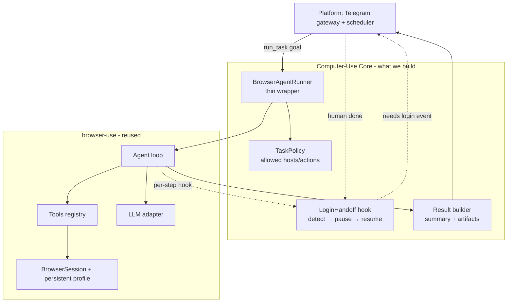
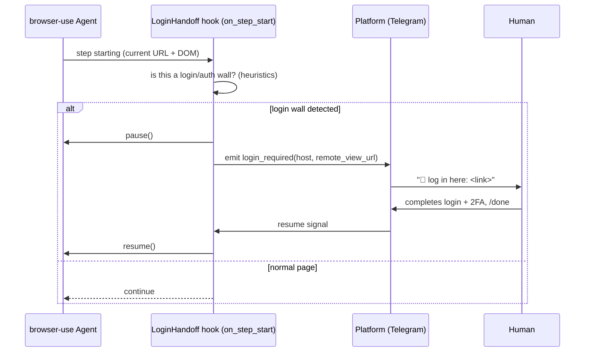

# Design: Computer-Use Core ("the hands")

> Draft v0.1 · 2026-06-26 · status: proposal / for review
> The browser-driving core for the on-call agent. Companion to
> `browser-agent-platform-design.md` (the platform/"brain + channel").
> Governed by §0 Occam's razor: **reuse the hard parts, build only what's missing.**

---

## 1. Purpose & the one attraction

The whole product's appeal: **you talk to your agent on your phone, and it does the
web job for you.** This doc covers only the *hands* — the component that actually
drives a browser to complete a task — not the Telegram channel or scheduler (those live
in the platform doc).

Design question this answers: **do we build our own browser driver, or reuse one?**

---

## 2. Occam's-razor decision: reuse `browser-use`, don't rebuild it

I analyzed the local `browser-use` codebase (`C:\src\browser-use`). Reimplementing its
low-level stack would be months of work and a clear over-engineering violation. We
**wrap** it and build only the thin layer it lacks (human-in-the-loop login + task
lifecycle).

### What browser-use already gives us (REUSE — do not rebuild)
From the codebase, its layers are:

| Layer | Path | What it does |
|---|---|---|
| **Agent loop** | `agent/service.py` | Step loop: get state → build messages → LLM → parse `AgentOutput` → run actions → record history → repeat until `done`/max-steps. Generic, event-bus driven, with **per-step hooks** (`AgentHookFunc`). |
| **LLM abstraction** | `llm/` | `BaseChatModel` + provider adapters (Anthropic, OpenAI, Google, DeepSeek, Groq…). Unified message schema. Bring-your-own key. |
| **Tools / action registry** | `tools/` | Pydantic-typed actions (`Click`, `InputText`, `Navigate`, `Scroll`, `Extract`, `Done`…) auto-described to the LLM; emit browser events. |
| **Browser session** | `browser/` | `BrowserSession` over CDP, event-driven with modular **watchdogs**, persistent **profile**, video/recording. |
| **Actor (raw action space)** | `actor/` | Low-level CDP: `Page`, `Element`, `Mouse` (click/fill/hover/select/drag, screenshots, JS eval). |
| **DOM perception** | `dom/` | Builds an **indexed DOM tree** — clickable elements get `[N]` indices so the LLM references elements by index, not pixels. |
| **Message manager** | `agent/message_manager/` | History build + context-window compaction. |
| **Filesystem / skills / tokens / observability** | resp. dirs | Agent working files, reusable skills, token cost, tracing. |

**Key patterns worth keeping in mind** (we inherit them for free):
- **Structured output**: `AgentOutput = current_state{thinking, evaluation_previous_goal,
  memory, next_goal} + actions[]` — the "reflect → plan → act" shape.
- **Indexed DOM** beats pixel vision for reliability/cost.
- **Action registry** with Pydantic schemas → auto tool schema.
- **Event-driven browser + watchdogs** for cross-cutting concerns.
- **Per-step agent hooks** — our integration seam (see §5).

### What browser-use does NOT give us (BUILD — this is our core)
1. **Human-in-the-loop login handoff** (pause on auth wall → ask human → resume).
2. **Task lifecycle** suited to a chat-driven, long-lived service (create/track/persist
   a task, return a clean result summary).
3. **A narrow allow-list policy** (which sites/actions are permitted per task).

That's it. Three small things on top of a big reused engine.

---

## 3. Our minimal core



### 3.1 Components (small on purpose)
- **`BrowserAgentRunner`** — the only public entry point. `run_task(goal, policy) -> Result`.
  Constructs a browser-use `Agent` with our LLM, a **persistent browser profile**
  (so sessions survive), registers the login-handoff hook, runs to completion.
- **`LoginHandoff` hook** — detects an auth wall, **pauses** the agent, emits a
  `login_required` event to the platform (which pings you on Telegram + opens the
  remote view), waits for a `resume` signal, continues. (Details §5.)
- **`TaskPolicy`** — a plain allow-list: permitted hosts + whether write/irreversible
  actions need approval. Enforced in the hook. No policy engine, just a dataclass + checks.
- **`Result` builder** — turns browser-use's final `Done`/history into a compact summary
  + artifact paths for the platform to send back.

### 3.2 Public surface (sketch)
```python
@dataclass
class TaskPolicy:
    allowed_hosts: list[str]
    require_approval_for_writes: bool = True

@dataclass
class Result:
    ok: bool
    summary: str
    artifacts: list[str]        # file paths in the workspace
    needed_human: bool          # did we hand off?

class BrowserAgentRunner:
    async def run_task(self, goal: str, policy: TaskPolicy) -> Result: ...
```

That's the whole core API. Everything else is browser-use.

---

## 4. Why not write our own agent loop / DOM / CDP layer?
Occam's razor, explicitly:
- The DOM-indexing + CDP + watchdog machinery is the *expensive, already-solved* part.
  Rebuilding it adds months and earns nothing.
- browser-use's **per-step hooks** are exactly the seam we need for login handoff, so
  we don't even need to fork it.
- If we ever outgrow it, we swap the engine *behind* `BrowserAgentRunner` without
  touching the platform. The wrapper is the abstraction boundary.

---

## 5. Login handoff (the one feature we actually build)

Mechanism, using browser-use's per-step hook:



**Detection (start dumb, per Occam):**
- v1: URL/host on a small known-login-host list, or DOM contains a password field
  (`input[type=password]`) / known login markers.
- Only add smarter detection if v1 misfires in practice.

**Pause/resume:** browser-use's agent exposes pause/resume; the hook flips a shared
`asyncio.Event` that the platform sets when the human signals `/done`. The human logs in
**in the same persistent profile**, so cookies persist → future tasks skip login until
expiry.

**No evasion:** if the site blocks automation outright (not just login), the hook
**stops and reports** — never circumvents. (Consistent with platform non-goals.)

---

## 6. Integration with the platform (one line each)
- **Input:** platform calls `runner.run_task(goal, policy)` (from a Telegram command or
  a scheduled job).
- **Handoff:** core emits `login_required`; platform owns Telegram + remote-view link.
- **Output:** core returns `Result`; platform formats the summary for chat.

The core knows nothing about Telegram. Clean boundary = easy to test and swap.

---

## 7. What we explicitly will NOT build (anti-over-engineering list)
- ❌ Our own CDP/DOM/indexing layer — reuse browser-use.
- ❌ Our own multi-provider LLM abstraction — reuse `llm/`.
- ❌ A policy/rules engine — a dataclass allow-list is enough.
- ❌ Stealth/proxy/captcha — out of scope and against non-goals.
- ❌ A plugin system, queue, or microservices — not until a real need appears.

---

## 8. MVP build steps (smallest useful first)
1. **M0 — Hello task**: `BrowserAgentRunner.run_task("go to example.com, return the H1")`
   wrapping browser-use with our LLM key + persistent profile. Returns a `Result`.
2. **M1 — Policy**: add `TaskPolicy` allow-list host checks in a hook.
3. **M2 — Login handoff**: detection heuristic + pause/resume via shared event; emit
   `login_required` (logged to console first, before Telegram exists).
4. **M3 — Wire to platform**: platform calls the runner; `login_required` → Telegram +
   remote view; `/done` → resume.

M0 is a few dozen lines on top of browser-use. Resist building more until M0 runs.

---

## 8.5 Future features (post-MVP)
- **Agent memory**: persistent cross-task memory (prior tasks, per-site login state, what
  succeeded) so the runner isn't stateless; lean on browser-use's filesystem/memory.
- **UX / latency**: optimize step latency and remote-view startup so phone interaction
  feels instant.

## 9. Open questions
- ~~Exact browser-use pause/resume + hook API names~~ → **confirmed in code**:
  `Agent.pause()` / `Agent.resume()` / `Agent.stop()` (sync, backed by an
  `asyncio.Event`); hooks `on_step_start` / `on_step_end` passed to `Agent.run()`,
  signature `Callable[[Agent], Awaitable[None]]` (awaited each step) — our handoff seam.
  Persistent profile via `BrowserSession(user_data_dir=...)`.
- ~~Remote-view transport~~ → **decided: CDP screencast** (single-tab, reuses browser-use
  CDP, lighter for mobile; see platform §5). noVNC rejected.
- Where the persistent profile lives on the 24/7 host → **on the persistent AWS VPS**
  local disk, beside the workspace (host decided in platform §13).
- Session-expiry frequency per target site → how often handoff fires.

---

## 10. One-line summary
> A thin `BrowserAgentRunner` wrapping `browser-use` (reused for the LLM loop, tools, CDP,
> DOM), plus the one thing it lacks — **human-in-the-loop login handoff** — exposed as a
> single `run_task(goal, policy) -> Result` call the phone-driven platform invokes.
