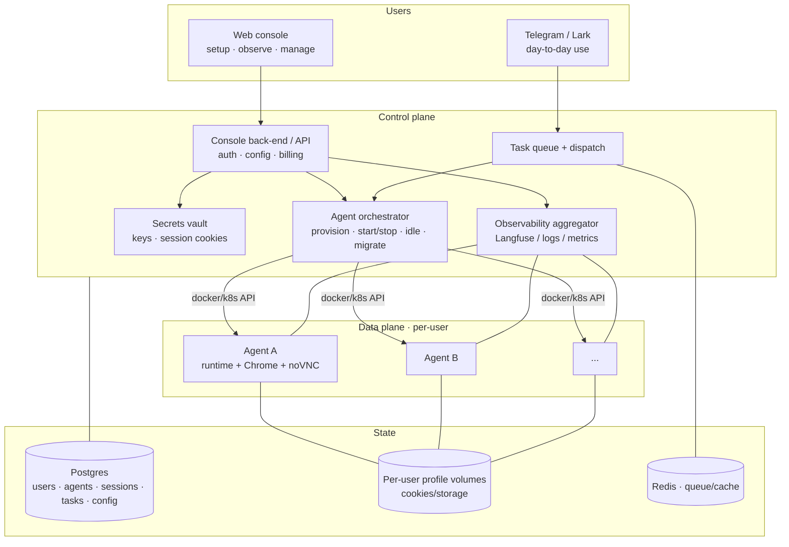

# Platform Vision — "Agent-as-a-Service" (dependent project, deferred)

> 2026-07-21 · designDoc/scaleToEnterpriseLevel
> **Status: PARKED / dependent project.** Do NOT build now. The main project stays a
> *lightweight, self-hosted personal agent*. This doc captures the vision for the day it
> grows into a managed platform, so the core stays cleanly wrappable.

---

## 1. The idea in one line

> A console (front-end + back-end) that **provisions, observes, and manages a
> dedicated agent instance per user** — "like AWS for personal browser agents." After
> setup, each user mainly talks to **their own agent** over Telegram (Lark later).

The lightweight agent (this repo) is the **unit**. The platform is the **fleet manager**
around many copies of it. Keep them decoupled: the agent exposes a clean interface
(start task → stream progress → login handoff → artifacts); the platform drives it.

---

## 2. Why it's inherently "platform work" (the forcing constraint)

Users **cannot share a Chrome core** (each holds *their own* logged-in sessions). So the
unit of isolation is **one browser per user → one container per user**. The moment you
have many users, you're running a *fleet of stateful containers* — that is exactly the
provisioning/lifecycle/billing problem AWS solves. There is no "just one big process"
shortcut; multi-user ⇒ orchestration.

---

## 3. Architecture

- **Web console (front-end + back-end)** — what users do *besides* chat: sign in,
  provision "my agent", set config (BYO API keys or shared, channel token, enabled
  capabilities/skills, allowed sites), **observe** (task history, live status, Langfuse
  traces, logs, the login-handoff link), and **manage** (start/stop/restart, rotate
  sessions, download artifacts, quota/billing).
- **Control plane** — auth, the **agent orchestrator** (provision / start / idle-stop /
  migrate a user's container), task queue + dispatch (session affinity: a task routes to
  the worker holding that user's browser), secrets vault, observability aggregation.
- **Data plane** — one **agent container per user** = the existing lightweight runtime
  (agent + Chrome + profile volume + noVNC handoff).
- **State** — Postgres (users, agents, sessions, tasks, config), per-user **profile
  volumes** (the heavy migratable state), Redis (queue/cache) later.
- **Channels** — Telegram now; **Lark later**. The channel is how a user talks to *their*
  agent; the console is for setup + observability.

---

## 4. State & migration ("cloud-like")

A user's agent = **stateless container + two pieces of durable state**:
1. **Postgres rows** (user, agent config, session pointer, tasks).
2. **Profile volume** (cookies/storage — the authenticated session).

Move `volume + DB row` → the agent moves hosts. Containers are cattle; **the volume + DB
are the pet.** This is what makes it migratable/schedulable across a fleet.

---

## 5. Scaling path (honest, staged)

| Stage | Users | Infra | Notes |
|---|---|---|---|
| S0 (now) | 1 (you) | one process, one browser | the lightweight personal agent |
| S1 (friends) | a handful | **1 host + Docker**, container-per-user, on-demand + idle-stop, cap | the "MINIMUM MULTI-USER" block in todo |
| S2 | dozens | multi-host + a scheduler (Nomad / ECS / k8s), Postgres + Redis, console | true fleet mgmt |
| S3 | many | + warm browser pool, autoscaling, cost/billing, per-tenant isolation hardening | the P1–P4 platform notes |

The DB + volume model at S1 already leaves the door open to S2/S3 — don't pre-build them.

---

## 6. MVP platform (smallest thing that lets friends self-serve)

If/when this is picked up, the minimum is NOT the whole diagram:
1. Thin **console**: sign in (allow-list), "create my agent" (spins a container),
   paste keys + Telegram token, see task history + login link.
2. **Orchestrator** = the on-demand Docker start/stop from the todo M-block.
3. **Postgres** for users/agents/tasks; **profile volumes** for sessions.
4. Reuse the existing **Langfuse** traces for the "observe" tab.

Lark, billing, autoscaling, multi-host → all deferred.

---

## 6.5 Compute & communication (control plane ↔ agents)

### Compute: can the agent run on serverless (Alibaba Function Compute)? — Resource yes, model NO.

FC's Custom Container runtime *can* fit a Chromium resource-wise (multi-GB RAM), but
serverless is the **wrong execution model** for our core agent. Our agent is stateful and
long-lived — the opposite of FaaS:

| Our agent needs | FaaS (FC) gives |
|---|---|
| Persistent authenticated session (cookies survive tasks — the moat) | ephemeral, recycled instances → session lost |
| Long-lived + human-in-the-loop (login handoff waits minutes) | request/response, scale-to-zero → pays to idle-wait for a human |
| Addressable, warm, sticky instance (session affinity) | no stable identity; can't target a user's warm browser |
| Interactive noVNC stream to the user | not built to host a long-lived interactive server |

**Decision:** run the persistent browser agent as a **long-lived container with a
persistent volume** — Alibaba **ECI** (Elastic Container Instance) / **ASK** (Serverless
K8s) / **ECS**, with a **NAS volume** for the per-user Chrome profile. FC is fine only for
**stateless helpers** (browser-less Phase-2 synthesis, one-shot fetch), never the
authenticated browser. Rule: *the persistent browser + login handoff is a stateful
service, not a function.*

### Communication: what wire between control plane and agents? — depends on scale.

Two DIFFERENT traffic types (conflating them is the classic mistake):
1. **Task dispatch** (control → agent): "run", "stop", "/done". Durable, queueable, retryable.
2. **Interactive/live** (agent ↔ user): progress stream, the **noVNC login link**, final
   artifact. Latency-sensitive; the noVNC stream is a **direct** agent↔user connection
   (via tunnel/ingress) — it does NOT pass through a queue or the control plane.

- **Friends scale (one host): NO message queue.** Control plane + agent containers are
  co-located; control plane starts a container (Docker API) and calls it directly over
  localhost HTTP; results land in the shared DB. Adding MQ here is over-engineering.
- **Platform scale (control plane on server A, agents on other servers): 3 channels,
  each for its own job:**
  - **MQ (RocketMQ / Kafka / Redis Streams)** for **task dispatch** — durable, buffers
    bursts, at-least-once + retries (ties into idempotency: `request_id` dedups a
    redelivery). **Must route with SESSION AFFINITY** — a flat queue would send a task to
    any worker, but it must hit *that user's warm browser* → per-user queue / routing key.
  - **WebSocket or gRPC stream** for the **interactive parts** (progress, handoff link,
    `/done`). Queues are wrong for these — you want a persistent bidirectional stream.
  - **Shared state (Postgres + OSS/NAS)** for task status + artifacts, so neither side
    must be up simultaneously; the agent writes the `.md` to OSS, the control plane serves it.
  - **noVNC login stream is direct** agent→user via the tunnel — never through MQ/control.

**What actually forces an MQ** is not "two servers" — it's *many agents you can't address
directly + bursty load + durable retries.* Add it then, not before.

### Resource sizing — multiple independent Chrome cores on one host

**Yes — you can run N independent Chromes in N containers on one machine.** Each
container is its own PID/mount/network namespace, so each has its own Chromium process,
its own `user-data-dir` (profile volume), and its own Xvfb display (internally `:99`,
isolated per container). They never collide. The only shared finite resource is host
RAM/CPU; the only thing you must manage is **mapping each container's noVNC port to a
unique host port** (or a per-container tunnel) for the login handoff.

Per active user (LLM runs *remote* → no local model memory):

| Component | RAM | Notes |
|---|---|---|
| Chromium (headful under Xvfb) | 0.8–1.5 GB | heavy sites (小红书/images) spike ~2 GB |
| Python agent (browser-use + libs) | 0.3–0.5 GB | — |
| Xvfb + WM + noVNC | ~0.2 GB | noVNC only during login handoff |
| **Per active user** | **~1.5–2 GB (budget 2 GB)** | CPU ~0.5–1 vCPU avg (LLM network waits dominate; spikes 1–2) |

**3 concurrent users:** ~6 GB (agents) + ~1–2 GB (control plane/OS) → **8 GB min, 16 GB
comfortable**; **4 vCPU** workable (8 comfortable); **~30–50 GB SSD**. Target a
**4 vCPU / 16 GB** VM (AWS `t3.xlarge`/`m7i.xlarge`; Alibaba `ecs.g7.xlarge` 4c16g).
Rough scaling: **+2 GB RAM per additional concurrent user.** The current **2 vCPU / 4 GB**
(`c7i-flex.large`) fits only **~1 user** — don't run 3 Chromes on 4 GB (OOM).

**Docker/Chrome gotchas (these bite specifically in containers):**
- **`/dev/shm` defaults to 64 MB → Chrome crashes on heavy pages.** Fix: run with
  `--shm-size=1g` *or* Chrome flag `--disable-dev-shm-usage`. (#1 Dockerized-Chrome failure.)
- **Per-container memory limit** (`--memory=2g`) so one runaway tab can't OOM-kill the
  *host* and take down other users.
- **Idle-stop** means you only pay RAM for *active* sessions — 10 registered friends but 3
  active ⇒ capacity for 3. That's how a small box serves more people than it can run at once.

---

## 7. Boundary with the main project (keep it a *dependent* project)

- The **lightweight agent stays the product** and the unit of value. It must run fully
  standalone (one user, one box) with zero platform.
- The platform **depends on** the agent via a stable interface, never the reverse:
  `provision(user, config) · start_task(user, request) → stream · handoff_link(user) ·
  artifacts(task)`. If that interface is clean, the platform is a wrapper you can build
  later without touching the core.
- Avoid leaking platform concerns (tenancy, billing, queues) into the agent code.

---

## 8. Open questions / risks

- **Cost & density** — container-per-user with headful Chrome is heavy (~0.5–1.5 GB
  each). Density is the core economic problem; warm-pool + idle-stop + hibernation are
  the levers. Billing must reflect this (per-active-hour, not flat).
- **Security / isolation** — you're running code inside users' authenticated sessions.
  Hard multi-tenant isolation (network, secrets, audit, kill switch) is non-negotiable
  before non-friends. See P4 in todo.
- **Secrets** — vault user API keys + session cookies; never in plaintext env (rotate the
  current one).
- **ToS** — keep the "user's own session, user logs in themselves" stance; per-site
  consent. Batch access to *others'* gated content at fleet scale is where legal risk
  concentrates.
- **Channels** — Lark integration is a separate connector; design the channel layer as a
  pluggable adapter so TG/Lark/web-chat share one core.

---

## 9. Relationship to existing notes

- The **P1–P4** block in `todo.txt` ("PLATFORM ARCHITECTURE + LATENCY/COST") is the
  deeper engineering treatment of this — control/data plane split, session/identity
  layer, browser pool, model routing. This doc is the *product/console* framing on top.
- The **MINIMUM MULTI-USER** block in `todo.txt` is S1 — the friends-scale first step.
- The **Supervisor + Capabilities** doc (`07_21_2026/`) is orthogonal: it makes a *single*
  agent extensible; this doc makes *many* agents manageable. Both compose.

---

## 10. One-line summary

> A deferred, dependent "agent-as-a-service" layer: a console that provisions and manages
> one containerized personal agent per user (state = Postgres + profile volume, so agents
> migrate), used day-to-day over Telegram/Lark — built only if the lightweight core earns
> the demand.
