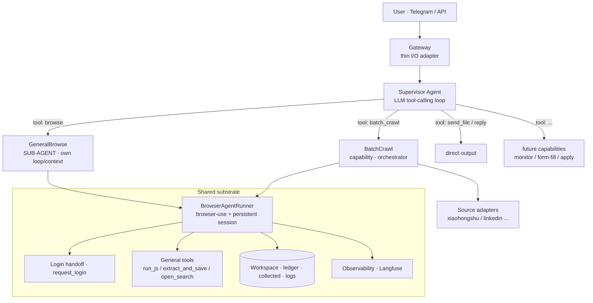
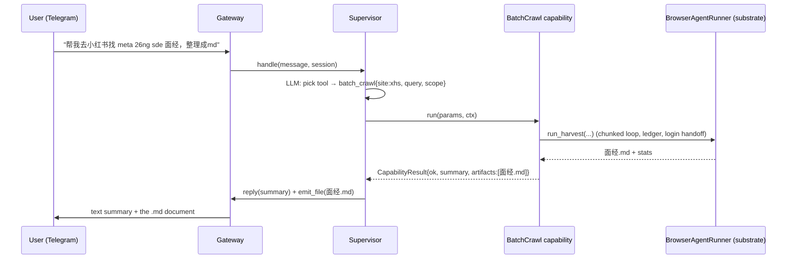

# Architecture Redesign — Supervisor Agent + Capabilities

> 2026-07-21 · designDoc/thingsToImprove/07_21_2026 · addresses todo 07/20 #4 ("current
> architecture is kind of ugly, can we optimize it?")

---

## 1. The problem (why it's "ugly" today)

Today the Telegram gateway does **hardcoded dispatch**:

```
/new <text>
   │
   ├─ route_request(text)  ← a separate LLM call that CLASSIFIES into fixed buckets
   │
   ├─ if harvest   → run_harvest(...)      (the batch-crawl orchestrator)
   ├─ elif skill   → skill.build_task + run_task(...)
   └─ else         → run_task(...)          (general browser-use agent)
```

Three problems:

1. **The "Intent Router" is a bolted-on classifier.** It's a second LLM whose only job is
   to sort requests into pre-declared buckets. Adding a new capability means editing the
   router *and* the gateway's branch tree. That's the "ugly."
2. **No composition.** A request can only be *one* bucket. "Search my saved posts, then
   collect the top authors' 面经 into a doc" can't chain browse → crawl.
3. **The mental model is inverted.** We built a *router in front of* the agents. But the
   right model (Claude Code / Copilot) is a **single capable agent that picks tools** —
   and the general browser agent is one of those tools (a *sub-agent*), not a sibling
   the router chooses between.

---

## 2. The reframe (Claude Code / Copilot mental model)

> There is **one top-level agent** (the *Supervisor*). It reads the user's request and
> **decides what to do by selecting tools** — exactly like Claude Code deciding to call
> `run_terminal` or spawn a sub-agent. "Routing" is just tool selection; it is **not** a
> separate component.

Two kinds of tools the Supervisor can call:

- **Sub-agents** — capable agents with their *own* loop and context, that return a
  concise result. The **GeneralBrowse** browser-use agent is a sub-agent (the
  "Claude-Code-like" worker for one-off interactive browsing).
- **Orchestrated capabilities** — deterministic multi-step machines. **BatchCrawl** (the
  long-horizon harvester: chunking + ledger + dedup) is one.

The Intent Router **disappears** — absorbed into the Supervisor's tool-calling.

---

## 3. Target architecture



**Before → After**

| | Before | After |
|---|---|---|
| Dispatch | `route_request` LLM + 3 gateway branches | Supervisor picks a tool |
| Add a capability | edit router + gateway branches | register one Capability |
| Multi-step tasks | impossible (one bucket) | Supervisor chains tool calls |
| General browser agent | a *sibling* the router chooses | a **sub-agent tool** the Supervisor calls |
| Parent context | N/A | stays small — sub-agents return only results |

---

## 4. Core abstractions

### 4.1 Supervisor (the top agent)
A small LLM tool-calling loop. Not browser-coupled.

```
Supervisor.handle(message, session):
    history = session.history + [user: message]
    loop (bounded):
        decision = LLM(history, tools=registry.tool_schemas())
        if decision.is_final:        # just answer
            return reply(decision.text)
        result = registry[decision.tool].run(decision.params, ctx)
        history += [tool_call, tool_result.summary]   # only the SUMMARY re-enters context
    # emit final reply + any artifacts (files)
```

- Its "tools" are generated **from the Capability registry** → no hardcoded branches.
- It keeps a per-session conversation; only **sub-agent summaries** re-enter its context
  (context stays cheap — see §7, and todo 07/20 #1).

### 4.2 Capability (the plug-in unit)
```python
class Capability(Protocol):
    name: str                       # "batch_crawl"
    description: str                # tells the Supervisor WHEN to use it
    Params: type[BaseModel]         # typed args → becomes the tool schema
    async def run(self, params: Params, ctx: RunContext) -> CapabilityResult

class CapabilityResult(BaseModel):
    ok: bool
    summary: str                    # concise text that re-enters Supervisor context
    artifacts: list[Path] = []      # files to deliver to the user
```

- Capabilities **self-register**; the Supervisor's tool menu is built from `description`
  + `Params`. **Adding one = new module + `register()`. No core edit.**

### 4.3 RunContext (what capabilities get)
Carries the shared substrate + user I/O so capabilities can act and report:
`request_id`, the `BrowserAgentRunner`, the login-handoff hook, `on_progress(msg)`
(stream to Telegram), `emit_file(path)`, and the observability trace.

### 4.4 The two capabilities we already have (wrapped, not rewritten)
- **GeneralBrowse** (sub-agent): `browse(task: str)` → wraps `BrowserAgentRunner.run_task`.
  Runs the browser-use loop (its own multi-step context) and returns a concise result.
- **BatchCrawl**: `batch_crawl(site, query, target, scope)` → wraps `run_harvest`. Returns
  the raw `面经.md` as an artifact.

Both reuse the **same substrate** (runner, session, handoff, tools, ledger, observability).

---

## 5. Why this is better

- **Extensible without refactor** — the #1 goal. New capability = one registered module;
  the Supervisor discovers it via the registry. No router, no gateway branches to touch.
- **Composable** — the Supervisor can chain: `browse` (find targets) → `batch_crawl`
  (collect) → `send_file`. Impossible today.
- **Right mental model** — matches Claude Code: one agent, many tools, some tools are
  sub-agents. Nothing artificial in front of it.
- **Context isolation** — a browser task can be 40 steps of huge DOM; the Supervisor only
  ever sees the sub-agent's *summary*, so the top context stays small and cheap (directly
  eases todo 07/20 #1 "what if the context window is full").
- **Reliability preserved** — the deterministic parts (crawl orchestration, dedup,
  login) stay in code/capabilities; the Supervisor only *chooses*, it doesn't hand-hold.

---

## 6. Control flow (example)



---

## 7. How it addresses the other open todos

- **07/20 #1 (memory / context window full):** sub-agent summaries keep the Supervisor
  context small; a `session.history` seam is the natural place to later add compaction /
  durable memory.
- **07/20 #2, #5, #7 (scale, queue, multi-sandbox):** the Supervisor + capabilities are
  *stateless request handlers*; the Gateway can enqueue jobs and the Supervisor run on a
  worker pool. Session affinity (a user's warm browser) is a substrate concern, unchanged.
- **07/21 #1 (extensibility as users grow):** the Capability registry **is** the
  extensibility surface — third parties add a capability without forking.

---

## 8. Migration plan (incremental — Occam)

Behavior-preserving, one seam at a time:

- **P0 — Capability interface + registry.** Add `Capability`, `CapabilityResult`,
  `RunContext`, and a registry. No behavior change yet.
- **P1 — Wrap existing paths as capabilities.** `GeneralBrowse` (wraps `run_task`) and
  `BatchCrawl` (wraps `run_harvest`). Register both. Still called by the old branches.
- **P2 — Introduce the Supervisor; delete the router.** Replace `route_request` + the
  gateway's 3 branches with `Supervisor.handle()`. The Supervisor's tools = the two
  registered capabilities. Same behavior, one clean path.
- **P3 — Context isolation.** Sub-agents return only summaries; Supervisor keeps a bounded
  session history.
- **P4 — Composition + new capabilities.** Allow chaining; add the next capability
  (e.g. `monitor_page`, `apply_to_job`) as a pure plug-in to prove the seam.

Each phase is independently shippable and revertible.

---

## 9. Tradeoffs / open questions

- **Extra hop?** The Supervisor is one LLM call — but it *replaces* `route_request`, so
  net cost is ~flat. Keep its prompt tiny (tool descriptions only).
- **Mis-selection risk.** The Supervisor could pick the wrong tool. Mitigate with crisp
  `description`s + typed `Params`, and capabilities that fail loudly (they already do).
- **Supervisor framework.** Build a small custom tool-calling loop (preferred, decoupled)
  vs. reuse browser-use's `Agent` (browser-coupled — avoid). Lean custom + `build_llm()`.
- **Alternative (simpler) shape.** Skip a separate Supervisor: make *GeneralBrowse* the
  top agent and expose `batch_crawl` as one of its tools. Fewer moving parts, but the
  top agent then carries browser context — worse isolation. Prefer the Supervisor split
  unless we want maximum simplicity for a first cut.

---

## 10. One-line summary

> Replace the bolted-on Intent Router with a **Supervisor agent that selects tools**,
> where the general browser agent is a **sub-agent** and specialized flows (batch-crawl,
> future ones) are **registered capabilities** over a shared substrate — so adding
> behavior is a plug-in, tasks compose, and the top context stays small.
